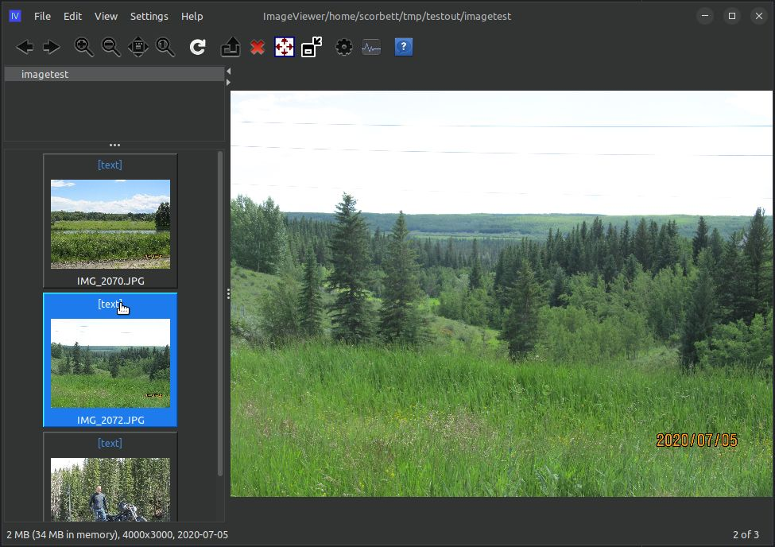
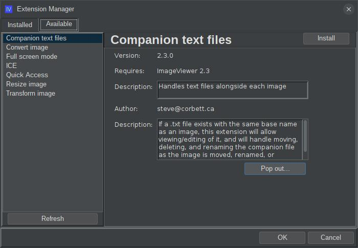

# ext-iv-companion-text-file

## What is this?

This is an extension for the [ImageViewer](https://github.com/scorbo2/imageviewer) application to allow text files to accompany images.
If you save a text file with the same base name as the image in the same directory, but with the "txt"
extension, you will see extra controls appear within imageviewer to view and edit this companion
text file:



You'll notice that there's a `[text]` hyperlink added to the top of each thumbpanel when a companion
text file is present for that image. If you click the hyperlink, you can view/edit the text:


## How do I get it?

### Option 1: automatic download and install

**New!** Starting in ImageViewer 2.3, you no longer have to manually build and install application extensions.
Now, you can use the "Available" tab on the extension manager dialog to find them:



Select "Companion text file" in the left menu and hit the "install" button in the top right. If you decide
to remove the extension later, go back to the extension manager dialog, select "Companion text file" on the
"Installed" tab, and hit the "Uninstall" button in the top right. The application will prompt to restart.
It's just that easy!

### Option 2: manual download

You can manually download the extension jar: 
[ext-iv-companion-text-file-2.3.0.jar](http://www.corbett.ca/apps/ImageViewer/extensions/2.3/ext-iv-companion-text-file-2.3.0.jar)

Save it in your ~/.ImageViewer/extensions directory and restart the application.

### Option 3: build from source

You can clone this repo and build the extension jar with Maven (Java 17 required):

```shell
git clone https://github.com/scorbo2/ext-iv-companion-text-file.git
cd ext-iv-companion-text-file
mvn package

# Copy the result to extensions dir:
cp target/ext-iv-companion-text-file-2.3.0-SNAPSHOT.jar ~/.ImageViewer/extensions
```

## Requirements

Imageviewer 2.3 or higher.

## License

Imageviewer and this extension are made available under the MIT license: https://opensource.org/license/mit
