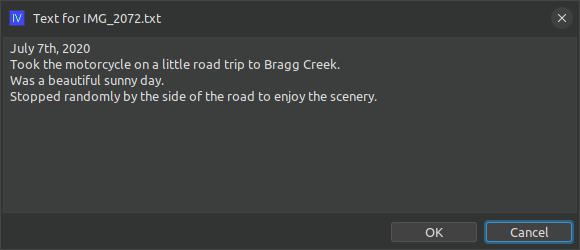

# ext-iv-companion-text-file

## What is this?

This is an extension for the imageviewer application to allow text files to accompany images.
If you save a text file with the same base name as the image in the same directory, but with the "txt"
extension, you will see extra controls appear within imageviewer to view and edit this companion
text file:


You'll notice that there's a `[text]` hyperlink added to the top of each thumbpanel when a companion
text file is present for that image. If you click the hyperlink, you can view/edit the text:



### How do I use it?

Clone the repo and build the extension jar with maven:

```shell
git clone https://github.com/scorbo2/ext-iv-companion-text-file.git
cd ext-iv-companion-text-file
mvn package
```

Now you can copy the extension jar to wherever you keep your imageviewer extensions:

```shell
cp target/ext-iv-companion-text-file-2.1.0-SNAPSHOT.jar ~/.ImageViewer/extensions
```

Then restart imageviewer and you can start using the extension.

### Requirements

Imageviewer 2.1 or higher.

### License

Imageviewer and this extension are made available under the MIT license: https://opensource.org/license/mit
